# Trekking Android App

A modern Android app that helps users explore trekking routes, waterfalls, and national parks in India. It includes authentication, a home dashboard with an image slider and AI-driven weather alerts, Google Maps with curated markers, safety tips, data viewing backed by Room (SQLite), a Gemini-powered chat assistant, and a static ML insights section.


## 📸 Application Screenshots

## 📸 Application Screenshots

| app_start_symbol | registration | ai_alerts |
|---|---|---|
|  | 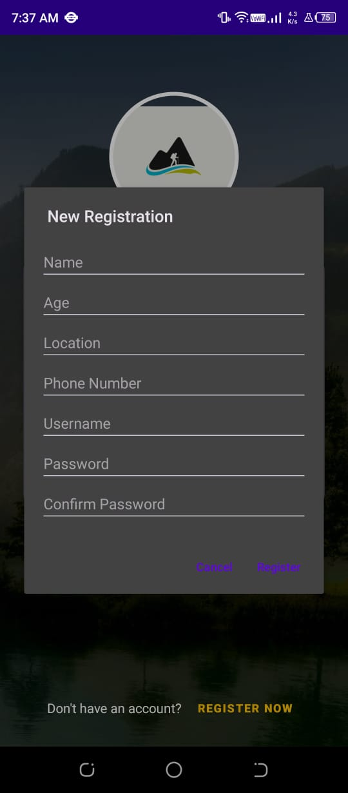 | 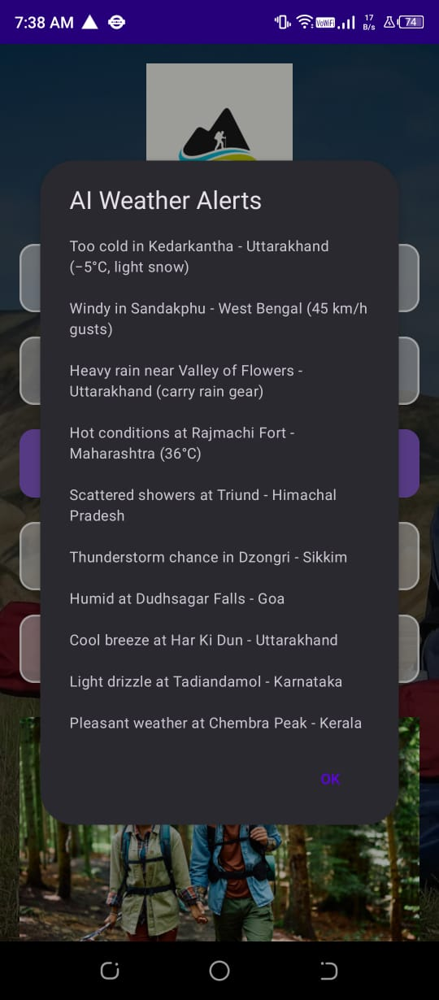 |

| ai_gemini_chatbot | ml_bert_model | waterfalls_list_data |
|---|---|---|
| 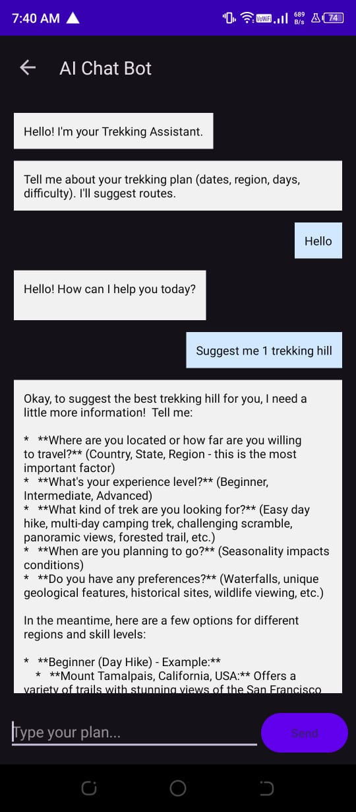 | 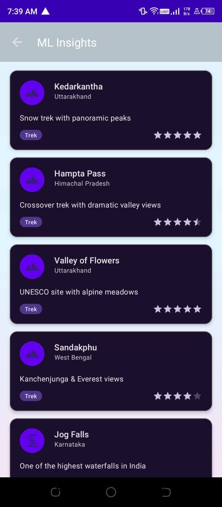 | 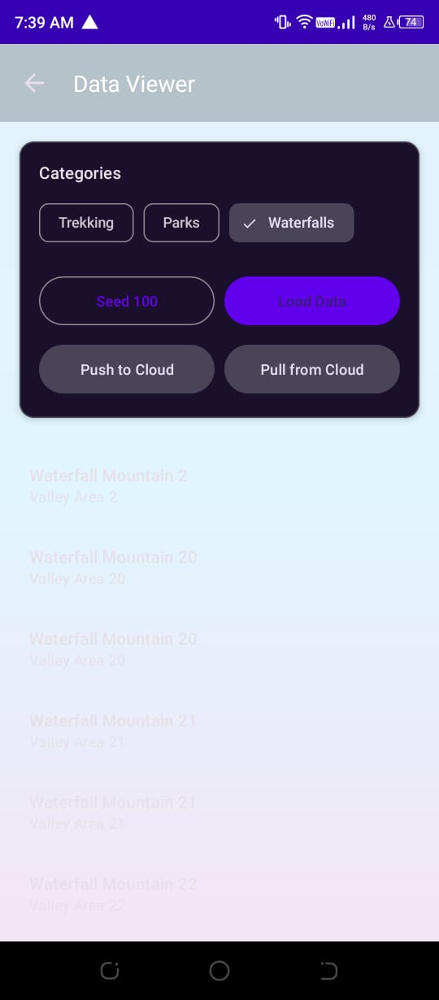 |

| trekking_list_data | dashboard | login |
|---|---|---|
| 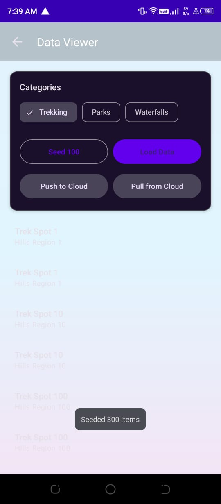 | 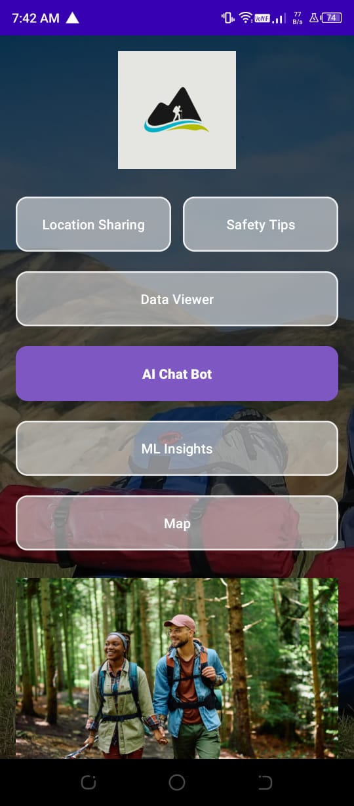 | 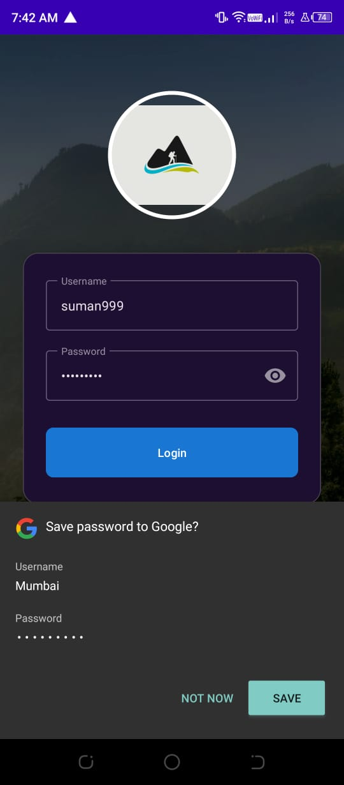 |

| login_page | location_sharing | ai_notifications |
|---|---|---|
| 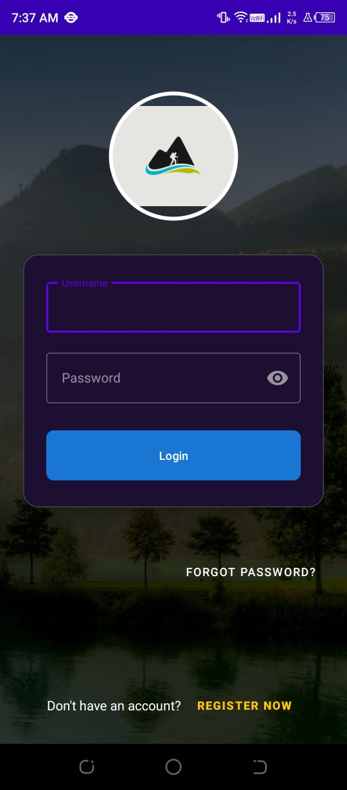 | 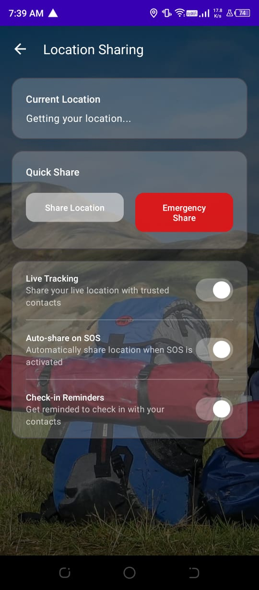 | 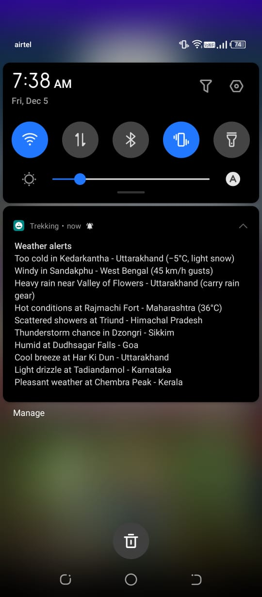 |

| safety_tips | maps_locations | firebase_users |
|---|---|---|
| 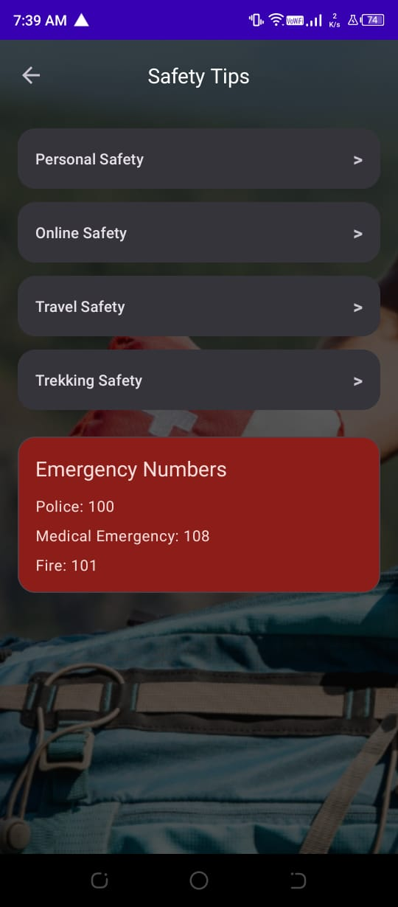 | 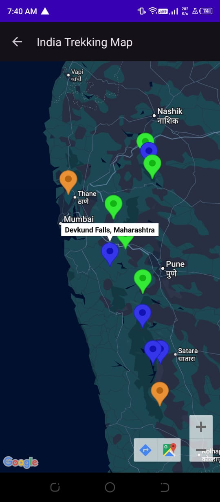 | 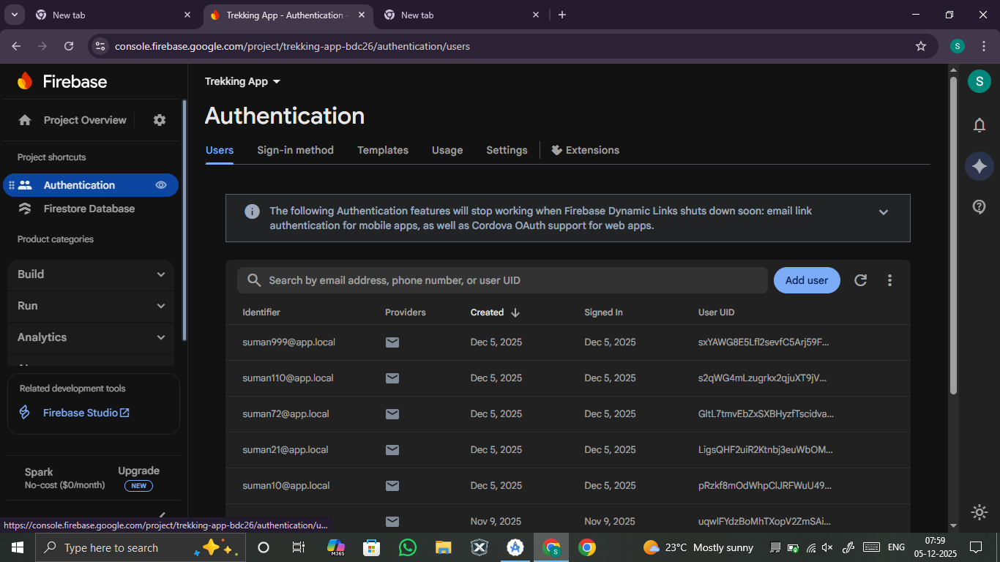 |

| firebase_authentication | firebase_project_details | firebase_cloud_messaging |
|---|---|---|
| 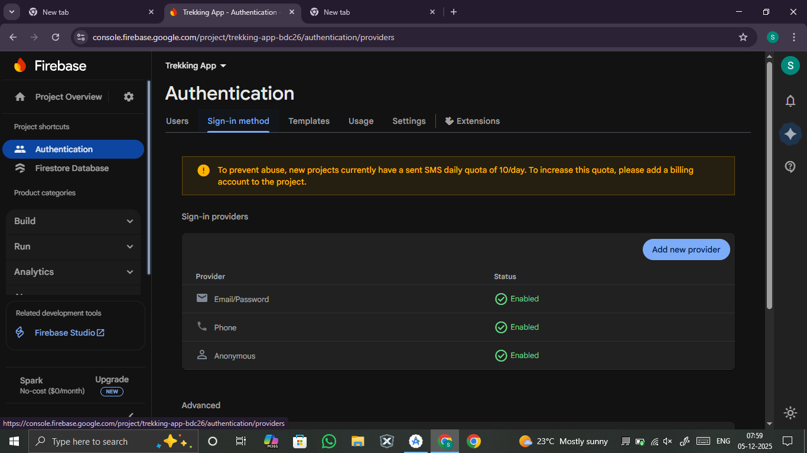 | 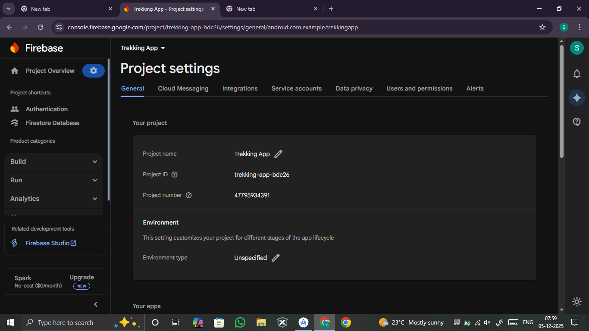 | 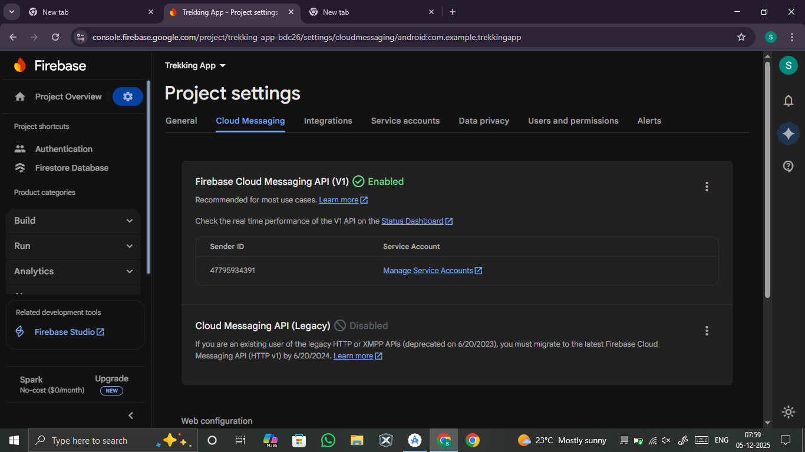 |


## Key Facts
- Package namespace: `com.example.trekking`
- Application ID: `com.example.trekkingapp`
- Min SDK: 28
- Target/Compile SDK: 34
- Language: Kotlin (JVM target 17)
- Build system: Gradle (Android Gradle Plugin 8.12.0, Kotlin 1.9.24)

## Features
- Authentication (Firebase Auth): Login with simple username/password scheme mapped to email; registration and forgot-password dialogs.
- Home Dashboard:
  - Image slider with animated dot indicators.
  - One-tap navigation to key modules.
  - AI weather alerts shown via notification and dialog on app entry.
- Maps (Google Maps SDK):
  - Map centered over Maharashtra with zoom controls.
  - Curated markers for trekking spots, waterfalls, and parks with color-coded markers.
- Safety Tips: Dedicated activity for trekking safety information.
- Location Sharing: Placeholder UI to demonstrate location-sharing flow (extendable).
- Data Viewer: Simple list backed by Room (SQLite) to show local places data.
- ML Insights: Recycler-based list of static insights with icons and ratings.
- AI Chat Assistant (Gemini): Chat UI backed by Google Generative AI client; prompts and responses rendered in a RecyclerView.
- Notifications: Notification channel for AI weather alerts.

## Activities and Flows
- SplashActivity: Launcher with splash theme.
- LoginActivity: Username/password login using FirebaseAuth; opens `MainActivity` on success.
- MainActivity: Home with buttons to navigate to Maps, Safety Tips, Data Viewer, AI Chat, ML Insights; shows weather alerts via notification and dialog; image slider at top.
- MapActivity: Google Map with curated markers and different hues per category.
- SafetyTipsActivity: Static content for trekking safety.
- LocationSharingActivity: Extendable screen for sharing location with contacts.
- DataViewerActivity: Displays data from Room database (places).
- MLInsightsActivity: Shows static insights list with icons and ratings.
- ChatBotActivity: Chat UI, integrates `ChatGeminiHelper` to call Gemini.

## Data Layer (Room)
- Entity: `PlaceEntity(id, name, location, category)` with table `places`.
- DAO: `PlaceDao` for CRUD operations.
- Database: `AppDatabase` provides `RoomDatabase` with the `places` table.
- Useful for offline display and local caching of curated places.

## AI Integration (Gemini)
- Library: `com.google.ai.client.generativeai:generativeai`.
- Helper: `ChatGeminiHelper` creates a `GenerativeModel(modelName = "gemini-2.0-flash")` using `BuildConfig.GEMINI_API_KEY`.
- Responses are generated asynchronously via coroutines and displayed in `ChatBotActivity`.

### Configure Gemini API key
The app reads the key in this order:
1. Environment variable `GEMINI_API_KEY`.
2. `gradle.properties` property `GEMINI_API_KEY`.
3. `local.properties` property `GEMINI_API_KEY`.

Add it in one of these locations (preferred: `local.properties` which is not checked in):
```
# local.properties
GEMINI_API_KEY=your_api_key_here
```
No code change is needed; the key is exposed to runtime as `BuildConfig.GEMINI_API_KEY`.

## Maps Integration (Google Maps)
- Uses `com.google.android.gms:play-services-maps`.
- The manifest currently includes a placeholder `meta-data` for `com.google.android.geo.API_KEY`.
- For production, move the key to `local.properties` + a manifest placeholder, or replace the value in the manifest with your own key.

Example (preferred secure setup):
```
# in local.properties
MAPS_API_KEY=your_maps_key
```
```
// in app/build.gradle
android {
  defaultConfig {
    manifestPlaceholders = [ MAPS_API_KEY: project.findProperty("MAPS_API_KEY") ?: "" ]
  }
}
```
```
<!-- in AndroidManifest.xml -->
<meta-data
  android:name="com.google.android.geo.API_KEY"
  android:value="${MAPS_API_KEY}"/>
```

## Firebase Setup
- Uses Firebase BoM with `firebase-auth-ktx` and `firebase-firestore-ktx`.
- `google-services.json` is already present at `app/google-services.json`.
- Ensure the Firebase project matches the appId `com.example.trekkingapp` or update as needed.

## Dependencies
- AndroidX core/appcompat/fragment/recyclerview/constraintlayout/material
- Coroutines (`kotlinx-coroutines-android`)
- Google Play Services Maps
- Firebase BoM, Auth, Firestore
- Room (`room-runtime`, `room-ktx`, KSP compiler)
- Google Generative AI client
- JUnit and AndroidX test libraries

Exact versions are defined in `app/build.gradle`.


## Build and Run
- Requirements:
  - Android Studio Ladybug+ (AGP 8.x compatible)
  - JDK 17
  - Android SDK 34
- Steps:
  1. Clone/open the project in Android Studio.
  2. Ensure `local.properties` contains your SDK path and optionally `GEMINI_API_KEY` and `MAPS_API_KEY`.
  3. Sync Gradle.
  4. Run the `app` configuration on a device/emulator (API 28+).

## App Permissions
- `INTERNET` for API calls (Gemini, Firebase, Maps).

## Notifications
- Channel: `weather_alerts_channel`.
- Shown on app entry via `MainActivity` with a BigTextStyle summary of alerts.

## Testing
- Unit tests with JUnit 4.
- Instrumented tests with AndroidX JUnit and Espresso (add tests under `androidTest/`).

## Troubleshooting
- "No response from Gemini" or error: verify `GEMINI_API_KEY` and network.
- Maps shows blank grid: ensure Maps API key is valid and the Maps SDK for Android is enabled.
- Firebase Auth fails: confirm the project configuration and SHA-1/256 if using advanced auth.
- Gradle sync issues: use JDK 17 and update Android Gradle Plugin per `settings.gradle`.

## Roadmap Ideas
- Add real weather API and ML-based hazard predictions.
- Persist user plans and chat history in Firestore.
- Real-time location sharing with contacts.
- Replace static insights with server-driven recommendations.

## License
Add your license here (e.g., MIT).
